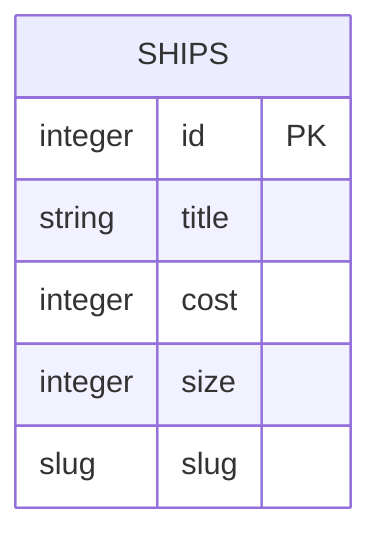

# About
Backend for the game Parsec Capitalism.
Made using:
- Django
- Sqlite (to be changes to PostreSQL)

---
**Table of Contents**
 - [Project Structure](#project-structure)
 - [Database Structure](#database-structure)
 - [Setup](#setup)
 - [API](#api)
---

## Setup

### Python

First, you need to activate virtual enviroment and install requirements.
This should be done from `~backend/`
```bash
#Create virtual enviroment
python3 -m venv venv 

# Launch virtual enviroment
source venv/bin/activate 

# If you need to deactivate
deactivate

# Install dependencies inside VE
python3 -m pip install -r requirements.txt 
```
After installing the packeges if you do command `pip3 list` the response should look something like that.
```bash
Package           Version
----------------- -------
asgiref           3.8.1
Django            5.0.6
flake8            7.0.0
flake8-docstrings 1.7.0
mccabe            0.7.0
pep8-naming       0.14.1
pip               24.1.1
pycodestyle       2.11.1
pydocstyle        6.3.0
pyflakes          3.2.0
snowballstemmer   2.2.0
sqlparse          0.5.0
```

### Django

Next step is to launch django project. Commands should be executed from `~backend/parsec_capitalism/`
```bash
# Migrate apps databases
python3 manage.py migrate

# Run the server 
python3 manage.py runserver
```
After that the server should be running and you can find it at [127.0.0.1:8000](http://127.0.0.1:8000/).

## Project Structure

Current version of a project consists of two apps:
- Homepage
- Ships

## Database Structure


## API
`/ships/api/ships-api/` - All the ships

